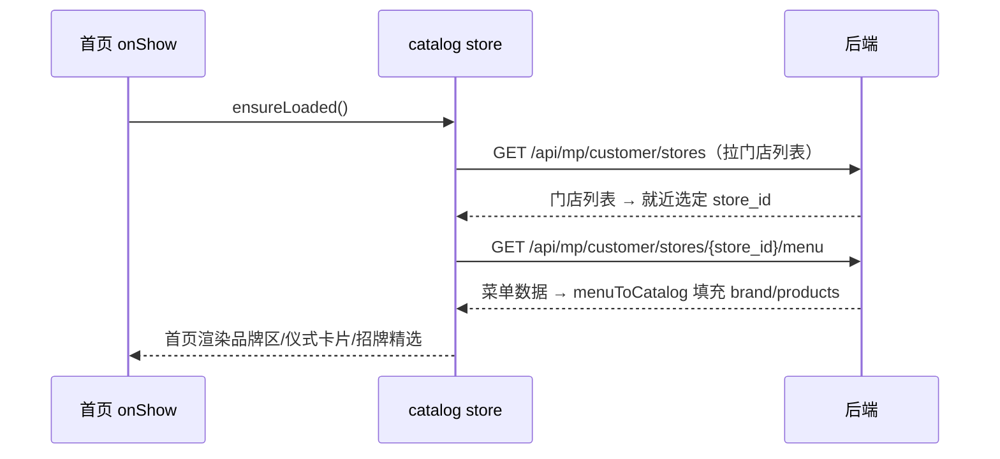

## 产品概述

进入首页时自动完成两段式数据加载：先向后端拉取门店列表并确定当前门店的 store_id，再以该 store_id 请求对应门店的菜单数据，使首页品牌区、仪式卡片、招牌精选等内容正常渲染。

## 核心功能

- 进入首页（含 tab 切回）时，先请求门店列表，按定位就近选出当前门店并得到 store_id
- 随后以该 store_id 请求该门店的菜单，填充品牌信息、仪式入口、商品与分类数据
- 已选定门店且菜单已加载时不重复请求；切换门店后按新 store_id 重新拉取菜单
- 加载中显示“加载中”，失败显示错误文案并可点击“重试”重新执行完整链路

## 技术栈

- uni-app + Vue 3（script setup）+ TypeScript + Pinia，目标端为微信小程序
- 请求封装：`src/plugins/request` 的 `http`（现有 `storeApi` / `catalogApi` 均基于它）

## 实现方案

复用 `src/stores/catalog.ts` 中已有的两段式流程，不新增重复逻辑：

1. 首页 `onShow` 由当前的 `void catalog.ensureStore()` 改为 `void catalog.ensureLoaded()`。
2. `ensureLoaded()` 内部链路即为用户描述的顺序：

- `ensureStore()`：`listMpStores`（GET `/api/mp/customer/stores`）拉门店列表 → `pickNearestStore` 按定位就近选店 → 写入 `currentStoreId`；
- 以该 `storeId` 调 `getStoreMenu(storeId)`（GET `/api/mp/customer/stores/{store_id}/menu`）拉菜单；
- `menuToCatalog` 填充 `brand / rituals / products / categories`，首页模板依赖的 `catalog.brand`、`featured`（来自 `catalog.products`）随之渲染。

3. 缓存语义沿用现状：`loadedStoreId === currentStoreId` 且 `products` 非空时跳过重复请求；`currentStoreId` 已存在时 `ensureStore` 不重复拉门店列表。选店页切换门店走 `selectStore` 强制重拉菜单，无需改动。
4. 异常处理已内置：`ensureLoaded` 捕获错误写入 `errorText`，首页模板已有 loading / error / 重试（重试按钮本就调用 `catalog.ensureLoaded()`），无需新增 UI。

其他页面（menu / select / coupons）均已使用 `ensureLoaded()`，不受影响；`App.vue` 仅做会话恢复，无需改动。

## 实现要点

- 仅改动 `src/pages/home/index.vue` 第 40 行一处，保持 `void` 前缀（onShow 中不阻塞、错误由 store 内 errorText 承接）。
- 不改动 `storeApi.ts` 现有未提交内容以外的逻辑，避免扩大影响面。
- 性能：依赖 `ensureLoaded` 既有缓存，tab 反复切回不会重复发起门店列表与菜单请求。

## 数据流



## 目录结构

```
src/
└── pages/home/
    └── index.vue   # [MODIFY] onShow 中 void catalog.ensureStore() 改为 void catalog.ensureLoaded()，
                    # 使进入首页时完成“门店列表 → store_id → 菜单”两段式拉取；模板 loading/error/重试无需改动
```