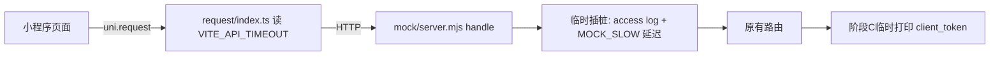

## User Requirements

用户要求一份缜密的「防抖 / busy 节流 / 超时幂等」三阶段测量方案，并按固定节奏执行：每个阶段先说明要改哪些文件的哪些地方 → 用户实测并观察指标 → 用户说「结束」后立即把该阶段改动还原 → 同时切换到下一阶段的修改，如此往复直到全部测完。

## Product Overview

在 uniapp_coffee 项目（uni-app 小程序 + 本地 mock 后端）上，通过临时仪器化 mock 服务与前端常量，分三轮验证：A. 确认订单页配送询价的 trailing 防抖合并；B. 购物袋 writeBusy 连点合并与定位 4 秒缓存；C. 客户端超时后重试的 client_token 幂等复用。全程为临时改动，最终工作区恢复原样，不提交任何 commit。

## Core Features

- 阶段 A：mock 加请求日志 + 延迟开关（本阶段延迟为 0），`CHECKOUT_DEBOUNCE_MS` 临时 300→1500，验证进页立即拉券、连切履约方式时 quote 请求被合并
- 阶段 B：mock 仅对购物车写接口加 1.5s 延迟，验证数量连点合量（+3 而非 +1）、加购连点被 writeBusy 拦截、4 秒内定位只走一遍
- 阶段 C：客户端超时改 2s + mock 订单接口延迟 5s，验证约 2 秒超时 toast、同指纹重试 client_token 相同、改券/切履约后出现新 token；会员 subscribe 单独一轮
- 每阶段结束立即还原对应改动；全部结束后核对 git diff 与 gitignore 的 env 文件，并提示用还原后的环境跑 smoke-test
- 全程不改 `clientToken.ts`、`geo.ts`、`timing.ts`、`request/index.ts`，不给加购/支付/领券加防抖

## Tech Stack Selection

沿用现有技术栈，不引入任何新依赖：

- mock 侧：Node.js 原生 http（`mock/server.mjs`）+ `mock/config.mjs` 已内置的 dotenv 加载（第 21 行 `loadDotEnv(path.join(root, '.env'))`，且仅在 key 不存在时写入 process.env）
- 前端侧：uni-app + Vue3 + Vite 环境变量（`.env.development` 的 `VITE_API_TIMEOUT`，由 `src/plugins/request/index.ts` 第 18 行只读消费）

## Implementation Approach

策略：**最小侵入的临时仪器化**。所有观测能力都加在 mock 服务端与两个环境文件上，前端只临时改一个常量；被测对象（防抖实现、busy 队列、意图 TTL、定位缓存、request 封装）一律不动，保证测的是线上真实行为。

关键决策与依据（均已核实行号）：

1. **access log + 延迟插桩位置**：`mock/server.mjs` 的 `handle()` 内、OPTIONS 分支（230–233 行）之后、各路由之前插入：`console.log('[mock]', req.method, path)`，再按 `MOCK_SLOW_MS`/`MOCK_SLOW_PATH` 匹配后 `await setTimeout` 延迟。这样终端可直接数请求次数，无需抓包工具。
2. **client_token 打印位置**：延迟逻辑在 readBody 之前拿不到 body，因此 `client_token` 的临时 console.log 放在 `POST /api/mp/customer/orders`（约 888 行）与 `POST /api/mp/customer/member/subscribe`（约 582 行）两个路由分支内、`readBody(req)` 之后，仅阶段 C 加入。
3. **延迟用环境变量开关**：`MOCK_SLOW_MS`/`MOCK_SLOW_PATH` 写进 `mock/.env`（config.mjs 会自动加载），默认 0 表示关闭；改值需重启 `npm run mock`。这样同一套插桩代码服务三个阶段，避免重复改 server.mjs。
4. **超时只改环境变量**：`.env.development` 第 30 行 `VITE_API_TIMEOUT=10000`→`2000`，Vite 不热更需用户重启 dev 编译；`request/index.ts` 本身不改。
5. **防抖窗口临时拉大**：`src/pages/checkout/index.vue` 第 57 行 `CHECKOUT_DEBOUNCE_MS=300`→`1500`（用户已确认），方便肉眼观察合并；阶段 A 结束必须改回 300。`onShow` 立即刷新逻辑不动。
6. **执行节奏（用户门控）**：每阶段我改完文件后输出「请重启 mock（阶段 C 同时重启 dev）→ 操作步骤 → 观察指标」并暂停；用户回复「结束」后才继续还原 + 下一阶段修改。重启动作由用户执行，我只改文件。

性能与可靠性：mock 延迟为 O(1) setTimeout，无副作用；延迟按 path 精确匹配（如 `/api/mp/customer/cart/items`），避免误伤其它接口导致测量干扰；阶段 C 单独把 `MOCK_SLOW_PATH` 换成 member/subscribe，不与 orders 同时慢，防止加购被卡 5 秒。

## Implementation Notes

- 严格区分三类观测目标：防抖看请求合并数、busy 看连点是否丢/合并、超时才需要把接口拖过客户端 timeout——不混用同一套 5 秒延迟。
- 还原清单（每处改动都有对应回退值，详见 Directory Structure 表格）；`.env.development` 与 `mock/.env` 被 gitignore，git diff 看不到，必须人工复述确认数值已还原。
- 不提交任何 commit；不动支付/领券/加购逻辑（无同意图契约，不用 5 秒延迟测它们）。
- 全部结束后提醒用户跑 `node mock/smoke-test.mjs`；若忘关 `MOCK_SLOW_MS=5000`，smoke 会极慢或失败，这正是最后一道校验。

## Architecture Design

在现有架构上做临时旁路插桩，不改数据流：



被测实现位置（只读不改）：

- 防抖：`src/utils/timing.ts` `createDebounced`（trailing）+ `checkout/index.vue` 第 57–58 行窗口与序号
- busy/合量：`src/stores/cart.ts` 41 行 `writeBusy`、92 行 `addToCart`、126/153/167 行 pendingQtyDelta 合量队列
- 幂等：`src/utils/clientToken.ts` 10 行 `INTENT_TTL_MS=5min`、61–62 行两个 intent、50 行 `isRetriableNetworkError`（超时保留意图）
- 定位缓存：`src/utils/geo.ts` 7 行 `LOCATION_TTL_MS=4000`、`locationInflight` 复用进行中 Promise

## Directory Structure Summary

全部为对现有文件的临时修改（执行期产生，最终全部还原），无新增文件。

```
f:/Project/uniapp_coffee/
├── mock/
│   ├── server.mjs          # [MODIFY-临时] 在 handle() OPTIONS 分支后插入 access log 与 MOCK_SLOW_MS/MOCK_SLOW_PATH 延迟块；阶段 C 再在 orders(约888行)/subscribe(约582行) 路由内 readBody 后打印 client_token。实现要求：延迟仅在 slowMs>0 且（未设 slowPath 或 method+path 包含 slowPath）时生效；测完整段删除。
│   └── .env                # [MODIFY-临时] 追加 MOCK_SLOW_MS / MOCK_SLOW_PATH 两行（A:0；B:1500+cart/items；C:5000+orders，会员轮换 subscribe）。实现要求：config.mjs 会自动加载，改后需重启 npm run mock；测完删除这两行。
├── .env.development        # [MODIFY-临时] 仅阶段 C：第 30 行 VITE_API_TIMEOUT=10000→2000，用户重启 dev 编译；测完改回 10000 再重启。
└── src/pages/checkout/
    └── index.vue           # [MODIFY-临时] 仅阶段 A：第 57 行 CHECKOUT_DEBOUNCE_MS=300→1500；测完改回 300。onShow 立即刷新不动。
```

各阶段「怎么测 / 看什么指标 / 能否还原」：

| 阶段 | 操作步骤 | 观察指标 | 测完还原 |
| --- | --- | --- | --- |
| A 防抖 | 登录且购物袋有货 → 进确认订单 → 切外卖（有地址）→ 1 秒内连切堂食/外卖 3 次停在外卖 | 进页立刻有 `GET coupons/usable`（不空等 0.3s）；`POST delivery/quote` 远少于 3 次（约落定 1 次）；看 mock 终端日志或 Network | `CHECKOUT_DEBOUNCE_MS` 回 300；mock/.env 保持 0 |
| B busy/缓存 | `MOCK_SLOW_MS=1500` 且 PATH=cart/items：PUT 未回前连点 + 三次；加购连点；选店页 4 秒内连点两次定位 | 数量最终 +3（非 +1）；第二次加购被 writeBusy 挡住、无 300ms 发呆；系统定位只完整走一遍 | `MOCK_SLOW_MS` 归 0 |
| C 超时/幂等 | timeout=2000 + `MOCK_SLOW_MS=5000` PATH=orders：提交订单 → 不返回上一页（onUnload 会 clear 意图）再同指纹提交 → 改券/切履约再提交；会员开通换 PATH=subscribe 单独一轮 | 约 2 秒 toast「网络连接失败」；前两次 POST body 的 client_token 相同；改指纹后出现新 token | server.mjs 仪器整段删、mock/.env 删两行、timeout 回 10000、确认常量已回 300 |
